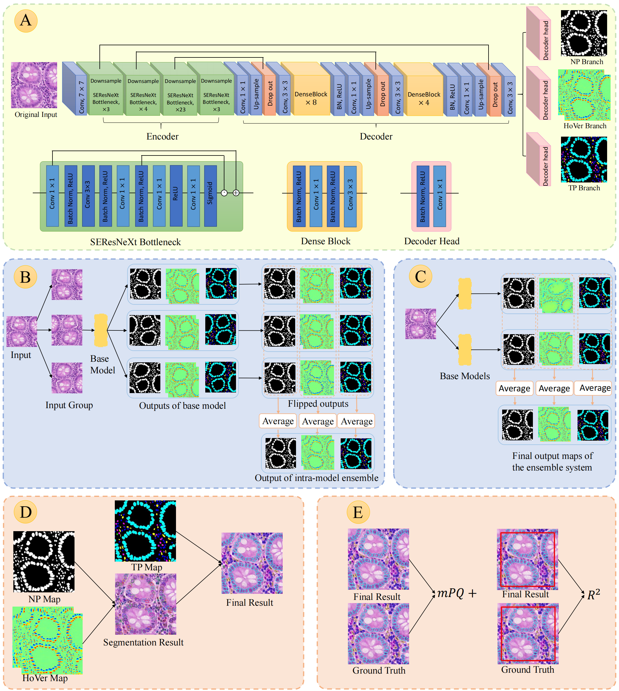
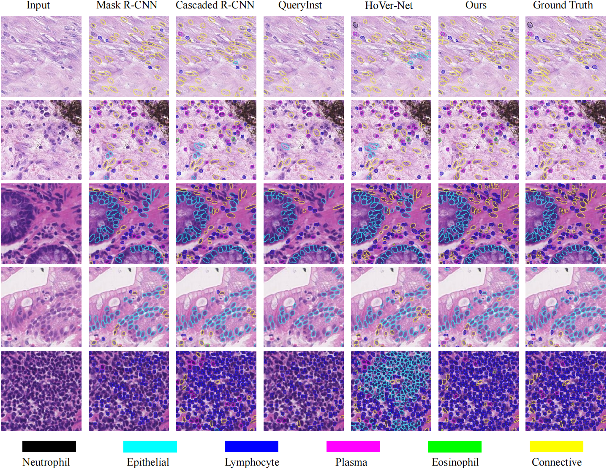

# Keep It Accurate and Robust: An Enhanced Nuclei Analysis Framework.

This repository contains PyTorch code for the paper:
Keep It Accurate and Robust: An Enhanced Nuclei Analysis Framework.

## Usage

### Inference
1. Download the pretrained [checkpoints and data splits](https://drive.google.com/drive/folders/1aausV8xxZiNv5pmfqq3k38yZh714Ssfq?usp=sharing)
2. Unzip them to the corresponded folders
3. Run the test script:
```
python scripts/eval_hv_ensemble_all.py
```

### Train
1. Prepare your data
2. Use the training script to train the 'se-resnext50' model first and then 'se-resnext101':
```
python scripts/train_head_hv.py --encoder_name seresnext50 --pretrained_path pretrained/se_resnext50_32x4d-a260b3a4.pth --name hover_paper_pannuke_seresnext50_split_0 --split 0

python scripts/train_head_hv.py --encoder_name seresnext101 --pretrained_path pretrained/se_resnext101_32x4d-3b2fe3d8.pth --name hover_paper_pannuke_seresnext101_split_0 --split 0
```

## Acknowledgement
1. Our code is modified from [hovernet](https://github.com/vqdang/hover_net).
2. The data is from [CONIC challenge](https://conic-challenge.grand-challenge.org/) 
3. The pretrained models for SE-ResNext is from [torchvision]()


## Citation

If any part of this code is used, please give appropriate citation to our paper. <br />

```
@article{zhang2024keep,
  title={Keep it accurate and robust: An enhanced nuclei analysis framework},
  author={Zhang, Wenhua and Yang, Sen and Luo, Meiwei and He, Chuan and Li, Yuchen and Zhang, Jun and Wang, Xiyue and Wang, Fang},
  journal={Computational and Structural Biotechnology Journal},
  volume={24},
  pages={699--710},
  year={2024},
  publisher={Elsevier}
}
```

This paper presents a practical and innovative approach for nucleus recognition and cellular composition analysis. Our method utilizes a standard U-Net model but focuses on effective training and testing strategies instead of designing new models. The model outputs three maps where each pixel determines its nucleus and category independently, overcoming the challenge of overlapping nuclei. To achieve robust and generalizable results, we introduce practical model training tricks and model ensemble methods. These significantly enhance performance, reducing overfitting and improving applicability to new data. Our approach also addresses the scarcity of large annotated datasets by using diverse training data from five sources.





## Overlaid Classification Prediction

<p float="left">
  
</p>

Results of different classification methods on histopathological patches of 20x in Lizard


## Authors

* [Wenhua Zhang](https://github.com/WinnieLaugh)

## License

The dataset provided here is for research purposes only. Commercial use is not allowed. The data is held under the following license:
[Attribution-NonCommercial-ShareAlike 4.0 International](https://creativecommons.org/licenses/by-nc-sa/4.0/)


